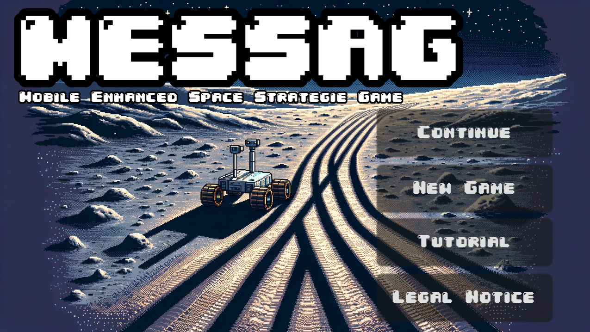
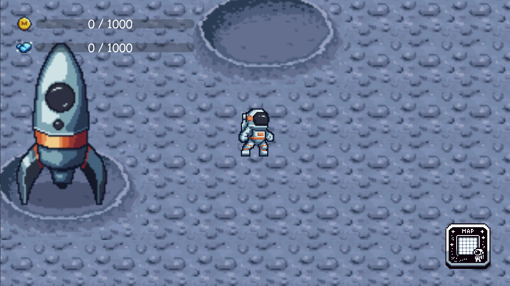
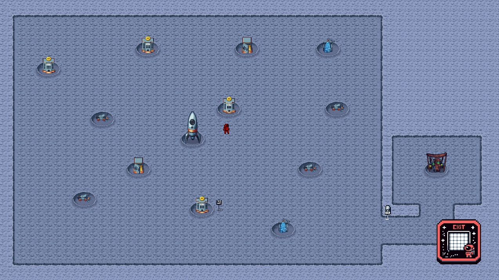
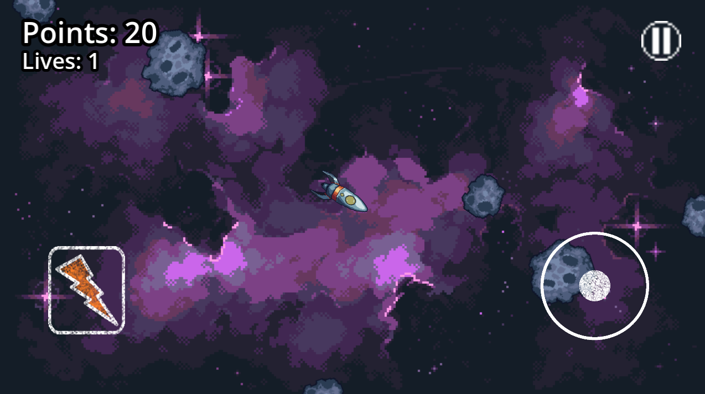
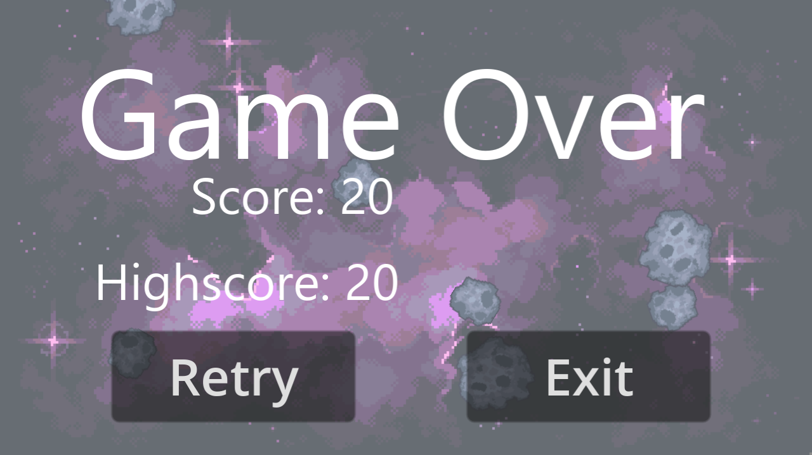
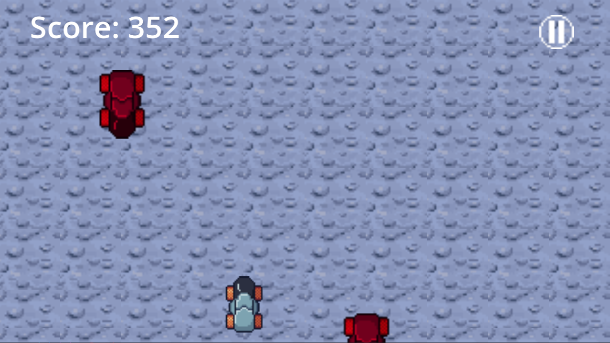
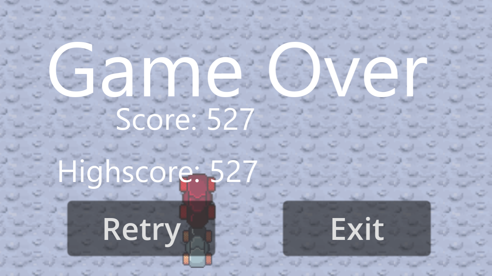

# MESSAG - 2D Pixel Art Mobile Game for IOS and Android

## Overview

Welcome to MESSAG, an engaging 2D pixel art mobile game set on the lunar surface! In this game, players control a character, move them by tapping on the screen, and embark on adventures on the Moon. The focus is on collecting resources (Moonets and Moonstones) through mini-games and expanding the lunar colony by purchasing and placing generators and storage buildings.

### Gameplay Mechanics

Players have the opportunity to play various mini-games to earn Moonets and Moonstones. Using these resources, they can purchase generators and storage buildings in the shop. Placing these buildings on predefined fields on the lunar surface increases resource production.

## Results

### **Start Menu Exploration:**



Immerse yourself in the engaging world of our game through the enticing "MESSAG" section in the start menu. Here, you'll encounter a selection of options tailored to enhance your gaming experience:

1. **Continue Your Adventure:**
   Rediscover the thrill by choosing the "Continue" option, seamlessly picking up from your previous gaming session. Your journey unfolds exactly where you left off, ensuring a continuous and captivating narrative.

2. **Embark on a New Game:**
   Ignite a fresh chapter in your gaming odyssey by selecting "New Game." This option offers you the opportunity to delve into uncharted territories, unveiling new challenges and exciting storylines.

3. **Guided Exploration with Tutorial:**
   Elevate your gameplay with the enriching "Tutorial" option. Whether you're a seasoned player or a newcomer, this interactive guide provides valuable insights, ensuring a comprehensive understanding of the game mechanics and features.

4. **Legal Insight in "Legal Notice":**
   Delve into the legal intricacies and foundational aspects of our game by navigating to the "Legal Notice" section under "MESSAG." Here, you'll find comprehensive information, ensuring transparency and a clear understanding of the legal framework surrounding our gaming universe.

This thoughtfully designed start menu is crafted to offer you a seamless, informative, and immersive experience right from the outset.
***
### **Lunar Odyssey Unveiled:**




Embark on a celestial adventure as you initiate the "New Game" option, materializing on the moon's surface adjacent to the rocket—your primary base. Opting for "Continue" seamlessly places you at your last exploration point, allowing fluid traversal through the expansive lunar landscape with a mere click on the screen.

**A Dozen Plots of Potential:**

Dive into a world of creativity and strategy with 12 strategically positioned plots awaiting your architectural prowess. Each plot serves as a canvas for constructing buildings, enabling you to sculpt and expand your lunar haven.

**Charting the Celestial Canvas:**

To gain a comprehensive view of your lunar dominion, a quick tap on the Map button in the lower right corner unfolds the celestial canvas. This feature offers a panoramic overview, facilitating strategic planning and providing a visual feast of your lunar surroundings.

Embark on your "Lunar Odyssey" and craft a cosmic masterpiece, building your lunar legacy one plot at a time. Explore the vastness of possibilities and shape your celestial destiny in this captivating lunar experience.
***
### **Celestial Minigames Unveiled:**

#### *Minigame 1: Comet Commander*




Embark on an intergalactic adventure by triggering the first minigame through the interface of the main base, your trusty rocket. Assume control of a nimble spacecraft, tasked with the mission of intercepting and obliterating oncoming comets. Unlike traditional space debris, these comets defy fragmentation, persistently reappearing in the cosmic expanse. Exercise caution, for each collision with a comet deducts one of your three precious lives. As the game concludes, a portion of your hard-earned points transforms into Mooneten, bolstering your lunar resources and enhancing your spacefaring arsenal.

#### *Minigame 2: Lunar Dodger*




For a unique lunar thrill, initiate the second minigame via the Mooneten-Generator. Take the helm of a lunar rover, navigating with finesse to dodge oncoming lunar rovers. A collision with another rover marks the culmination of the game. In the aftermath, a fraction of your accumulated points transmutes into Moonstones, a valuable addition to your lunar treasury, poised to fund further cosmic endeavors.

Embark on these enthralling cosmic challenges, honing your spacefaring skills and accumulating invaluable resources that will play a pivotal role in your ongoing lunar conquest. The vastness of the cosmos awaits, and these captivating lunar exploits are your ticket to celestial mastery.
***
### **Resource Mastery:**

In the cosmic economy of your game, two essential resources reign supreme—*Mooneten* and *Moonstones*.

**Mooneten:** 

Obtainable through the daring exploits of Minigame 1, Comet Commander, Mooneten represent the spoils of celestial warfare. Successfully navigate the treacherous comet-laden space, and your coffers will be enriched with this primary lunar currency.

**Moonstones:** 

The lunar landscape is also home to Minigame 2, Lunar Dodger, where adept maneuvering of your moon rover yields Moonstones. Evade collisions with fellow lunar rovers, and these precious gems become part of your lunar treasury.

**Generator Bounty:**

In addition to minigame triumphs, the Mooneten Generator and Moonstone Generator play crucial roles in resource acquisition. These structures act as cosmic wellsprings, consistently generating Mooneten and Moonstones, respectively, ensuring a steady influx of resources to fuel your lunar ambitions.

**Currency in the Cosmos:**

Both Mooneten and Moonstones serve as the universal currency in your lunar realm. Navigate to the shop armed with these cosmic riches, and unlock a plethora of structures to expand and enrich your celestial domain.

**Cosmic Commerce:**

Utilize your hard-earned lunar resources wisely in the shop to acquire new buildings, strategically enhancing and broadening your lunar landscape. Resource management becomes the key to unlocking the full potential of your cosmic conquest.

Master the delicate balance of Mooneten and Moonstones, and watch as your lunar world flourishes with each strategic investment in the expansive and captivating cosmos you're building.
***
#### 3. Shop and Building Placement

The shop offers a variety of generators and storage buildings for purchase. After acquisition, players can place these buildings on predefined fields to boost their resource production.


#### 5. Progression and Challenges

The game features advanced mechanics where players can overcome challenges and maximize their progression on the lunar surface.


## Files and Directories

1. **/View/Images**
   - Contains pixel art graphics and images used in the game.

2. **/View/Minigame1**
   - Implementation files for the first mini-game.

3. **/View/Minigame2**
   - Implementation files for the second mini-game.

4. **/View/Optionbar**
   - Code and assets related to the in-game options bar.

5. **/View/Player**
   - Code and resources for the player character.

6. **/View/Welt**
   - Components and scripts related to the game world.

7. **/View/data_script.gd**
   - Game data script containing information about resources, buildings, and other game-related data.

8. **/View/project.godot**
   - The main Godot project file.

The organization of folders within the `/View` directory helps maintain a clear and modular structure for different aspects of the game. The mini-game folders contain specific implementations, while the `/Optionbar`, `/Player`, and `/Welt` directories focus on distinct elements of the game's user interface, character, and world, respectively.

Additionally, the `/data_script.gd` file stores crucial game data, and the `/project.godot` file is the main configuration file for the Godot game engine.

## System Setup and Execution

1. **Download Source Code**

   Clone the repository from [GitHub Link].

   ```bash
   git clone https://github.com/YourUsername/MESSAG.git
   ```

2. **Install Dependencies**

   Ensure you have all the required dependencies installed. Use the following:

   ```bash
   pip install -r requirements.txt
   ```

3. **Start the Game**

   Run the game on your local development device:

   ```bash
   python main.py
   ```

4. **Test and Enjoy**

   Verify that the game functions as expected. Play different mini-games, buy buildings in the shop, and experience the fascinating world of MESSAG!

Certainly! Let's create a separate section for the closing statements:

## Conclusion

Thank you for exploring MESSAG, our captivating 2D pixel art mobile game set on the lunar surface. We hope you enjoy navigating the lunar terrain, playing exciting mini-games, and expanding your lunar colony.

For more in-depth information about each game component and a detailed overview of the development process, please visit our [Wiki page](https://github.com/AmirKarma/MESSAG/wiki).

Feel free to provide feedback, report issues, or share your experiences with us. Your input is invaluable as we continue to enhance and refine the MESSAG gaming experience.

Get ready to embark on an extraordinary lunar adventure – enjoy playing MESSAG!
