# MESSAG - 2D Pixel Art Mobile Game for IOS and Android

## Overview

Welcome to MESSAG, an engaging 2D pixel art mobile game set on the lunar surface! In this game, players control a character, move them by tapping on the screen, and embark on adventures on the Moon. The focus is on collecting resources (Moonets and Moonstones) through mini-games and expanding the lunar colony by purchasing and placing generators and storage buildings.

### Gameplay Mechanics

Players have the opportunity to play various mini-games to earn Moonets and Moonstones. Using these resources, they can purchase generators and storage buildings in the shop. Placing these buildings on predefined fields on the lunar surface increases resource production.

## Results

### **Start Menu Exploration:**


Immerse yourself in the engaging world of our game through the enticing "MESSAG" section in the start menu. Here, you'll encounter a selection of options tailored to enhance your gaming experience:

1. **Continue Your Adventure:**
   Rediscover the thrill by choosing the "Continue" option, seamlessly picking up from your previous gaming session. Your journey unfolds exactly where you left off, ensuring a continuous and captivating narrative.

2. **Embark on a New Game:**
   Ignite a fresh chapter in your gaming odyssey by selecting "New Game." This option offers you the opportunity to delve into uncharted territories, unveiling new challenges and exciting storylines.

3. **Guided Exploration with Tutorial:**
   Elevate your gameplay with the enriching "Tutorial" option. Whether you're a seasoned player or a newcomer, this interactive guide provides valuable insights, ensuring a comprehensive understanding of the game mechanics and features.

4. **Legal Insight in "Legal Notice":**
   Delve into the legal intricacies and foundational aspects of our game by navigating to the "Legal Notice" section under "MESSAG." Here, you'll find comprehensive information, ensuring transparency and a clear understanding of the legal framework surrounding our gaming universe.

This thoughtfully designed start menu is crafted to offer you a seamless, informative, and immersive experience right from the outset.
***
### **Celestial Guided Learning:**

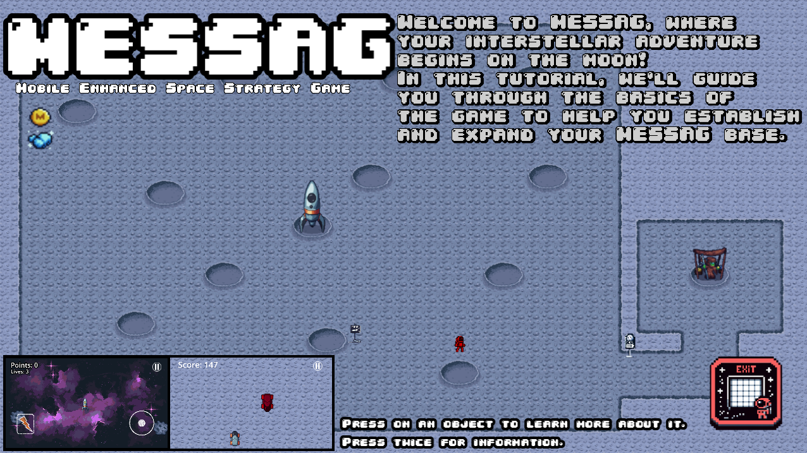

Embark on a journey of cosmic comprehension with the interactive tutorial, accessible directly from the start menu. This educational odyssey guides you through the intricacies of the game, unraveling all essential features within the lunar realm.

*Highlights of the Tutorial:*

1. **Navigational Insight:**
   - Learn to navigate the expansive lunar landscape with ease, understanding the controls and interface.

2. **Minigame Mastery:**
   - Master the two thrilling minigames - Comet Commander and Lunar Dodger - unraveling strategies for success.

3. **Resource Management:**
   - Delve into the art of resource gathering, emphasizing the roles of Mooneten and Moonstones in your cosmic conquest.

4. **Building Your Empire:**
   - Understand the significance of structures like Mooneten and Moonstone Generators, as well as Storages, in shaping your lunar realm.

5. **Shop Savvy:**
   - Navigate the celestial emporium, discovering how to wisely spend Mooneten and Moonstones for optimal lunar development.

6. **Inventory Insights:**
   - Explore the inventory system, where acquired structures are managed and strategically placed on the lunar field.

7. **Upgrades Unveiled:**
   - Grasp the concept of upgrades, enhancing the efficiency and capabilities of your lunar structures for sustained growth.

The tutorial serves as your cosmic guide, ensuring you command every aspect of your lunar empire with confidence and finesse. Launch it from the start menu and immerse yourself in the cosmic wisdom that will pave the way for your triumphant celestial journey.
***
### **Lunar Odyssey Unveiled:**


Embark on a celestial adventure as you initiate the "New Game" option, materializing on the moon's surface adjacent to the rocket—your primary base. Opting for "Continue" seamlessly places you at your last exploration point, allowing fluid traversal through the expansive lunar landscape with a mere click on the screen.

**A Dozen Plots of Potential:**

Dive into a world of creativity and strategy with 12 strategically positioned plots awaiting your architectural prowess. Each plot serves as a canvas for constructing buildings, enabling you to sculpt and expand your lunar haven.

**Charting the Celestial Canvas:**

To gain a comprehensive view of your lunar dominion, a quick tap on the Map button in the lower right corner unfolds the celestial canvas. This feature offers a panoramic overview, facilitating strategic planning and providing a visual feast of your lunar surroundings.

Embark on your "Lunar Odyssey" and craft a cosmic masterpiece, building your lunar legacy one plot at a time. Explore the vastness of possibilities and shape your celestial destiny in this captivating lunar experience.
***
### **Celestial Minigames Unveiled:**

#### *Minigame 1: Comet Commander*


Embark on an intergalactic adventure by triggering the first minigame through the interface of the main base, your trusty rocket. Assume control of a nimble spacecraft, tasked with the mission of intercepting and obliterating oncoming comets. Unlike traditional space debris, these comets defy fragmentation, persistently reappearing in the cosmic expanse. Exercise caution, for each collision with a comet deducts one of your three precious lives. As the game concludes, a portion of your hard-earned points transforms into Mooneten, bolstering your lunar resources and enhancing your spacefaring arsenal.

#### *Minigame 2: Lunar Dodger*


For a unique lunar thrill, initiate the second minigame via the Mooneten-Generator. Take the helm of a lunar rover, navigating with finesse to dodge oncoming lunar rovers. A collision with another rover marks the culmination of the game. In the aftermath, a fraction of your accumulated points transmutes into Moonstones, a valuable addition to your lunar treasury, poised to fund further cosmic endeavors.

Embark on these enthralling cosmic challenges, honing your spacefaring skills and accumulating invaluable resources that will play a pivotal role in your ongoing lunar conquest. The vastness of the cosmos awaits, and these captivating lunar exploits are your ticket to celestial mastery.
***
### **Resource Mastery:**

In the cosmic economy of your game, two essential resources reign supreme—*Mooneten* and *Moonstones*.

**Mooneten:** 

Obtainable through the daring exploits of Minigame 1, Comet Commander, Mooneten represent the spoils of celestial warfare. Successfully navigate the treacherous comet-laden space, and your coffers will be enriched with this primary lunar currency.

**Moonstones:** 

The lunar landscape is also home to Minigame 2, Lunar Dodger, where adept maneuvering of your moon rover yields Moonstones. Evade collisions with fellow lunar rovers, and these precious gems become part of your lunar treasury.

**Generator Bounty:**

In addition to minigame triumphs, the Mooneten Generator and Moonstone Generator play crucial roles in resource acquisition. These structures act as cosmic wellsprings, consistently generating Mooneten and Moonstones, respectively, ensuring a steady influx of resources to fuel your lunar ambitions.

**Currency in the Cosmos:**

Both Mooneten and Moonstones serve as the universal currency in your lunar realm. Navigate to the shop armed with these cosmic riches, and unlock a plethora of structures to expand and enrich your celestial domain.

**Cosmic Commerce:**

Utilize your hard-earned lunar resources wisely in the shop to acquire new buildings, strategically enhancing and broadening your lunar landscape. Resource management becomes the key to unlocking the full potential of your cosmic conquest.

Master the delicate balance of Mooneten and Moonstones, and watch as your lunar world flourishes with each strategic investment in the expansive and captivating cosmos you're building.
***
### **Celestial Architectural Ensemble:**

#### 1. **Mooneten Generator:**
   
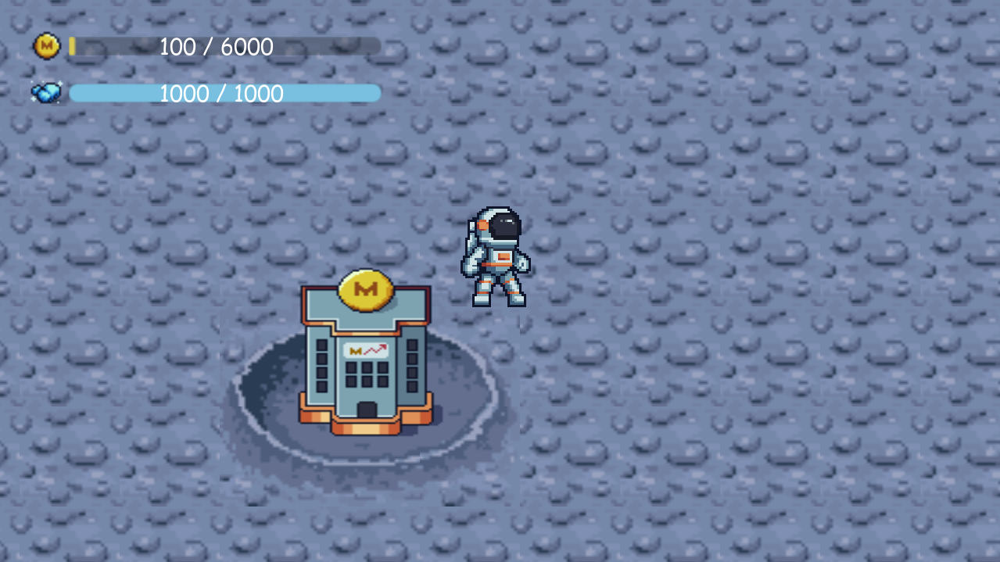
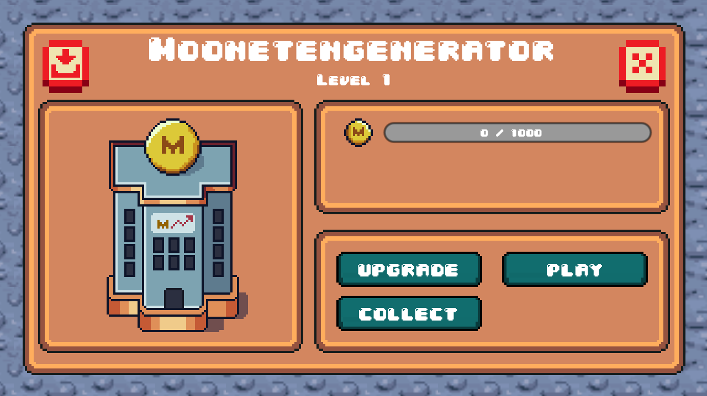
   - The pulsating heart of your lunar economy, the Mooneten Generator tirelessly produces Mooneten at regular intervals.
   - Resources accumulate within the generator, awaiting your strategic collection to fund your lunar aspirations.
   - Elevate your lunar production by upgrading the generator, unlocking the potential for increased Mooneten yield per minute.

#### 2. **Moonstone Generator:**

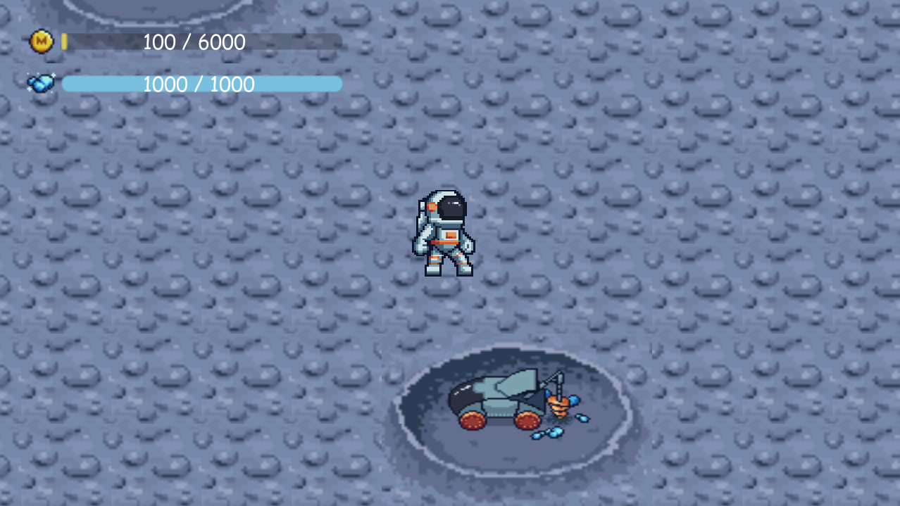
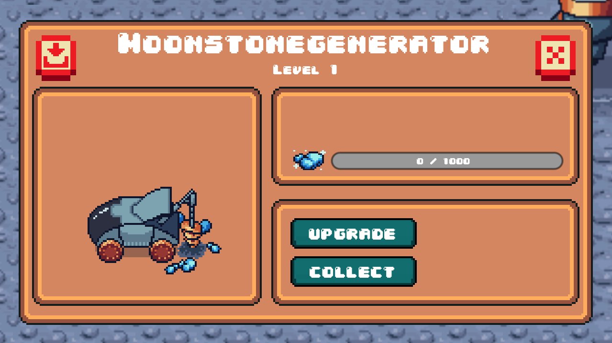
   - A cosmic gem in your lunar infrastructure, the Moonstone Generator diligently crafts Moonstones over time.
   - These precious lunar gems are stored within the generator, ready for your collection to fuel your celestial ventures.
   - Optimize your lunar resource generation by upgrading the Moonstone Generator, ensuring a continuous and bountiful supply.

#### 3. **Mooneten Storage:**
   
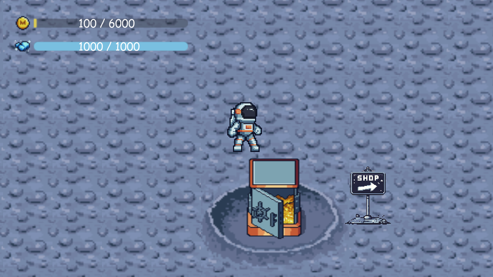
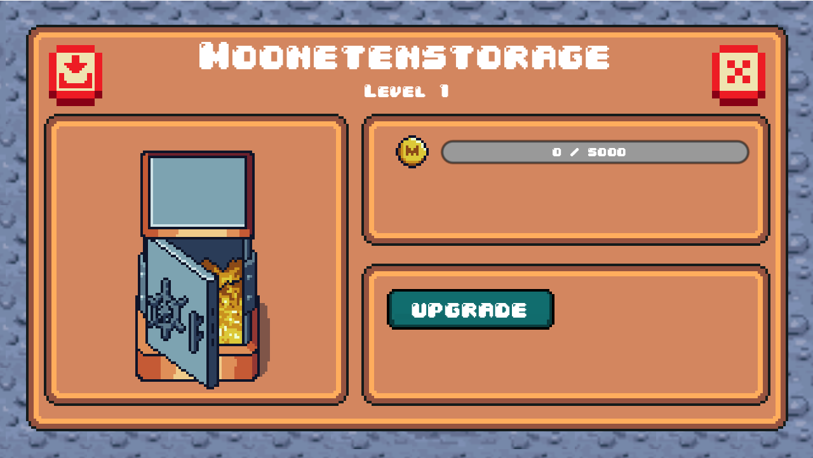
   - A lunar vault designed to securely harbor your amassed Mooneten resources, protecting them from the cosmic expanse.
   - Upgrade the storage facility to expand its capacity, allowing for the accumulation of larger reserves of Mooneten, ready to be deployed when needed.

#### 4. **Moonstone Storage:**

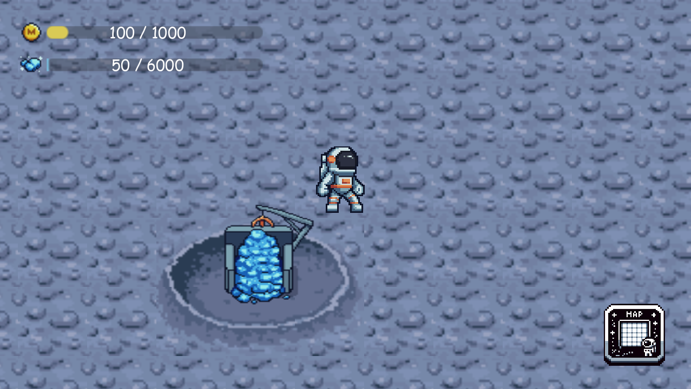
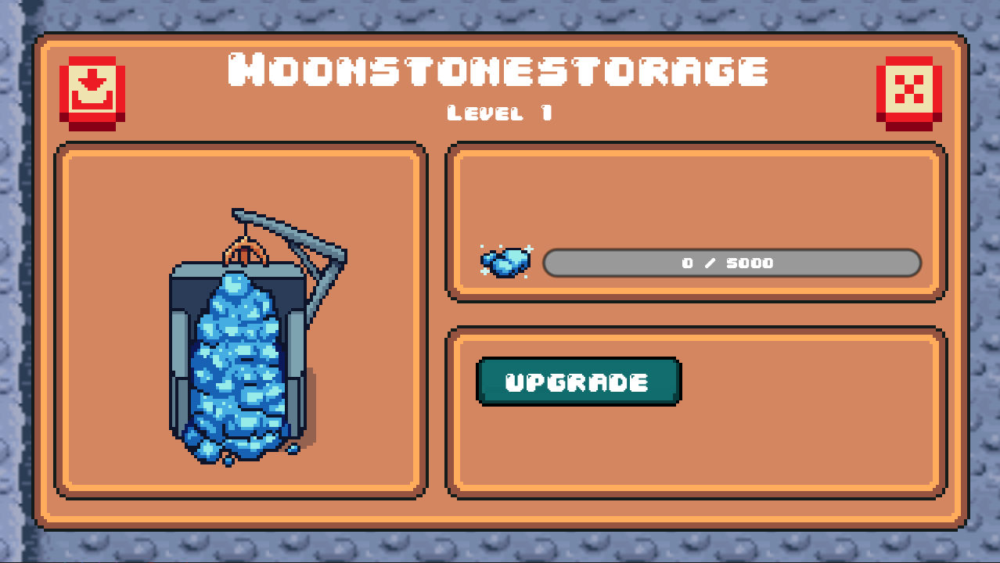
   - The lunar repository for your valuable Moonstones, ensuring their safekeeping and strategic utilization.
   - Enhance your cosmic treasury by upgrading the Moonstone Storage, providing ample space for the ever-growing collection of Moonstones.

As your Mooneten and Moonstone Generators diligently toil, their produced resources beckon for collection, while the Storage units stand as guardians of your celestial wealth. Upgrade these structures judiciously to harmonize production and storage, unlocking the full potential of your lunar empire. The cosmic ballet of production, collection, and strategic upgrades forms the cornerstone of your celestial prosperity.
***
### **Celestial Marketplace Highlights:**

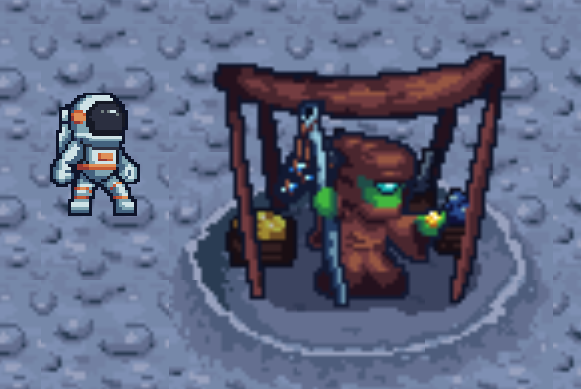
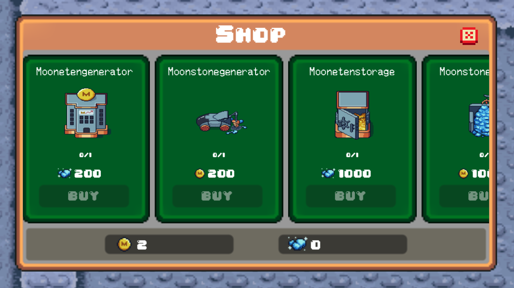

Step into the cosmic marketplace, where Mooneten and Moonstones hold the key to lunar expansion. Within this celestial emporium, discover essential structures like the *Mooneten Generator*, *Moonstone Generator*, *Mooneten Storage*, and *Moonstone Storage*. Strategically invest your resources to build, expand, and thrive in the vastness of your lunar empire. The lunar frontier beckons, and these highlighted structures are your gateway to celestial prosperity.
***
### **Cosmic Inventory Management:**

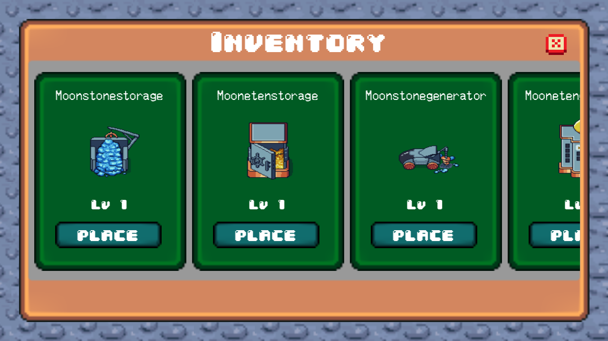

Upon purchasing buildings from the shop, they seamlessly manifest in your inventory. Access your inventory by tapping on an available building plot, revealing a selection of owned structures. Choose from the buildings you possess and strategically place them on the field. Navigate this cosmic inventory to sculpt and enhance your lunar realm, ensuring every building finds its optimal place in the celestial tapestry of your burgeoning empire.

## Files and Directories

1. **/View/Images**
   - Contains pixel art graphics and images used in the game.

2. **/View/Minigame1**
   - Implementation files for the first mini-game.

3. **/View/Minigame2**
   - Implementation files for the second mini-game.

4. **/View/Optionbar**
   - Code and assets related to the in-game options bar.

5. **/View/Player**
   - Code and resources for the player character.

6. **/View/Welt**
   - Components and scripts related to the game world.

7. **/View/data_script.gd**
   - Game data script containing information about resources, buildings, and other game-related data.

8. **/View/project.godot**
   - The main Godot project file.

The organization of folders within the `/View` directory helps maintain a clear and modular structure for different aspects of the game. The mini-game folders contain specific implementations, while the `/Optionbar`, `/Player`, and `/Welt` directories focus on distinct elements of the game's user interface, character, and world, respectively.

Additionally, the `/data_script.gd` file stores crucial game data, and the `/project.godot` file is the main configuration file for the Godot game engine.

## System Setup and Contribution

If you're eager to dive into the lunar adventure without the hassle of development, follow these simple steps to experience the game:

1. **Game Installation:**
   - Head over to the [Releases](https://github.com/AmirKarma/MESSAG/releases) section of this repository.
   - Download the provided .apk file for Android or the corresponding package for iOS.

2. **Device Compatibility:**
   - Ensure your Android device allows installations from unknown sources. For iOS, follow the standard installation procedure.

3. **Installation:**
   - Install the game by following the standard app installation process on your device.

4. **Game Launch:**
   - Locate the game icon on your device and tap to launch the cosmic odyssey.

Enjoy the lunar conquest and cosmic challenges!
***
If you're keen on exploring the intricacies of the lunar universe and contributing to the project, follow these steps:

1. **Clone the Repository:**
   - Open your terminal or Git Bash.
   - Run the following command to clone the repository:
     ```
     git clone https://github.com/AmirKarma/MESSAG.git
     ```

2. **Navigate to the Project:**
   - Move into the cloned directory using the command:
     ```
     cd MESSAG
     ```

3. **Open in Godot:**
   - Inside the cloned folder, you'll find a file named `project.godot`.
   - Open Godot Engine and choose "Import" in the project manager.
   - Select the `project.godot` file to open the lunar project in Godot.

4. **Embark on Your Cosmic Coding Journey:**
   - Explore the codebase, tweak the gameplay, or contribute new features!
   - Refer to the [Contribution Guide](https://github.com/AmirKarma/MESSAG/wiki/Contribution-Guide) in the Wiki page for guidelines on contributing to the project.

With the repository cloned and the project loaded in Godot, you're now ready to immerse yourself in the lunar coding adventure. May your cosmic contributions shine brightly in the vastness of the open-source galaxy!

## Conclusion

Thank you for exploring MESSAG, our captivating 2D pixel art mobile game set on the lunar surface. We hope you enjoy navigating the lunar terrain, playing exciting mini-games, and expanding your lunar colony.

For more in-depth information about each game component and a detailed overview of the development process, please visit our [Wiki page](https://github.com/AmirKarma/MESSAG/wiki).

Feel free to provide feedback, report issues, or share your experiences with us. Your input is invaluable as we continue to enhance and refine the MESSAG gaming experience.

Get ready to embark on an extraordinary lunar adventure – enjoy playing MESSAG!
